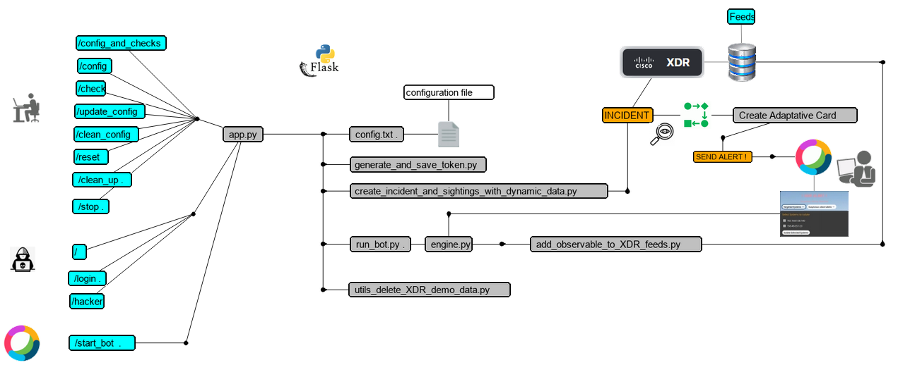

# Lab Simulator for XDR Endpoint Infection demo 
( version_20231223 )

This lab simulator is a python flask application that simulate endpoint infection for Cisco XDR Demos.

This is actually a tiny web server that listen on http port 4000. This one is supposed to be installed into your laptop.

The simulator exposes a Web GUI that is a network diagram you can interact with. The simulator manages interaction with your Cisco XDR tenant as well.

The web GUI simulates an endpoint infection which creates incidents and sightings into your Cisco XDR Tenant. Exactly like what happen in real life during real infections.

We simulate the infection, but we create a real Cisco XDR Incident. We do this because we don't want to use real attacks or real malwares for the demo. But within XDR the resultis the same.

The demo relies on a Webex Bot alerting system which will receive Webex Alert Cards sent by an XDR Incident Workflow which will be automatically triggered when an Incident will be created by this XDR demo.  The goal is to allow the security operator to select observables to block into the alert formular displayed in Webex. And add them into XDR Feed by clinking into the displayed "block" button.

In order to manage this specific service, the simulator includes a Websocket Webex Webhook management Features you must start once the flask application is started.

## Installation

A Pre requisit before moving forward on the lab simulator installation is to have a python interpreter installed and running into your laptop.

If you are not sure of this, then open a terminal console and type the following command :

	python -V

The result of this command is the version of your installed python interpreter. This version must be at least 3.7. 
The application was created with python 3.11

If you don't have any python interpreter then you have to install one.

If your laptop is a windows machine the install **Python for Windows** package. This one install everything you need ( and don't forget to click on the [ add python to path] checkbox in the installer GUI ). Python 3.11 was the version used for creating this app.

If your python interpreter is correctly working, then you are good to go to next steps.

Next step ...

### Step 1. Create a working directory

Create a working directory into your laptop. Open a terminal CMD window into it. Name It **XDR_Lab** for example.

### Step 2. Copy the code into your laptop

**The Download ZIP Method**

The most easy way for anyone not familiar with git is to copy the **ZIP** package available for you in this page. Click on the **Code** button on the top right of this page. And then click on **Download ZIP**. 

Unzip the zip file into your working directory.

**The "git clone" method with git client**

And here under for those of you who are familiar with Github.

You must have a git client installed into your laptop. Then you can type the following command from a terminal console opened into your working directory.

	git clone https://github.com/pcardotatgit/lab_simulator-002.git

### Step 3. Go to the code subfolder

Once the code unzipped into your laptop, then Go to the **code** subfolder.

	cd lab_simulator-002-main\code
    
### Step 4a. Quick Start only for Windows Users

This section is only for windows users. In order to make installation steps easier, some batch files had been prepared for you.  You just have to run them one after the other.
    
You must have a CMD console openned into your code folder :

    c:\path_to_working_directory\working_directory\lab_simulator-002-main\code
    
Then type one after the other the batch files

    install1
    install2
    install3
    install4

And then you can start the simulator by typing the letter **b** and **Enter**:

You should see the flask application starting. 

All depencies are installed then. Later when you will run again the simulator you will just have to type first the letter **a** + **Enter**, letter **b** + **Enter**

### Step 4b. If you don't go to the Quick Start Method, then go to the step by step installation method here under

### Step by step installation : 1 Create a Python virtual environment

It is still a best practice to create a python virtual environment. Thank to this you will create a dedicated package with requested modules for this application.

**Create a virtual environment on Windows**

	python -m venv venv 
    

**Create a virtual environment on Linux or Mac**

	python3 -m venv venv

    Depending on the python version you installed into your Mac you might have to type either 

    - python -m venv venv

    or maybe

    - python3 -m venv venv    : python3 for python version 3.x  

    or maybe 

    - python3.9 -m venv venv  : if you use the 3.9 python version

And then move to the next step : Activate the virtual environment.

**Activate the virtual environment on Windows**

	venv\Scripts\activate
    
**Activate the virtual environment on Linux or Mac**

	source venv/bin/activate    

### step by step installation : 2 Install needed python modules

You can install them with the following 2 commands one after the other ( Windows / Mac / Linux ):

The following command might be required if your python version is old.
	
	python -m pip install --upgrade pip   
    

Then install required python modules ( Windows / Mac / Linux )

	pip install -r requirements.txt

### step by step installation : 3 Start the simulator

Just run the flask application as a python script ( Windows / Mac / Linux ) :

	python app.py

For windows ( only ) users you can type :

	b  This is a bat file which start the simulator

At this point you should see the flask application starting into the console and then your browser must open on the Lab Portal page.

This web server listens to port 4000. At anytime you can open the index page at **http[://]localhost:4000**.

You can **stop the flask application** thanks to the [ Close App ] button in the web GUI, or by typing Ctrl+C into the application console.

## How to Start the simulator when python package and modules are already installed :

Open a CMD console into the code folder and type :

Type the letter **a** to start the python virtual environment

And then the letter **b** to start the simulator  

Ready to go !

## What to do when the Flask Application is started

The first time ou run the application you must complete the application setup by configuring some initialisation parameters.

For doing so, click on the **[Settings]** button in the top menu and enter the correct values for :

- **CTR client ID**
- **CTR client password**
- **Bot Token**
- **Webex Room ID**
- Select your region

Click on the **[Save Changes]** button.

That means that as pre requisists :

First you must have created your XDR API Client.

Second you must have created a Webex Bot and you hust have open a conversation with it. You can refer to this article [
webex_for_xdr_part-5_websocket ](https://github.com/pcardotatgit/webex_for_xdr_part-5_websocket).

For information the **Webex Room ID** can be seen into the application console when you send anything into the Webex Room you opened with the Bot.

For technical reasons the Webex Bot can't be started automatically when you start the application. For this reason you must start it manually everytime you start the application by clicking on the **[Start Webex Bot]** button. 

Then you can check that it is started into the application console thanks to the message : **the message : Websocket Opened**.
Then you can type anything into the room you openned with the bot. You are suppose to see that the text you send was received by the bot logic into the application console ( the room ID is one of the parameter we see in the console )

## Application Architecture

The diagram here under describes the application architecture. This is a Flask Application

## Application flow

the 2 diagrams below describe the Operation flow

### Phase 1 : Create a incident from detection done by Endpoint Security Solution and Send an alert formular into webex alert room

### Phase 2 : response action from webex alert action

